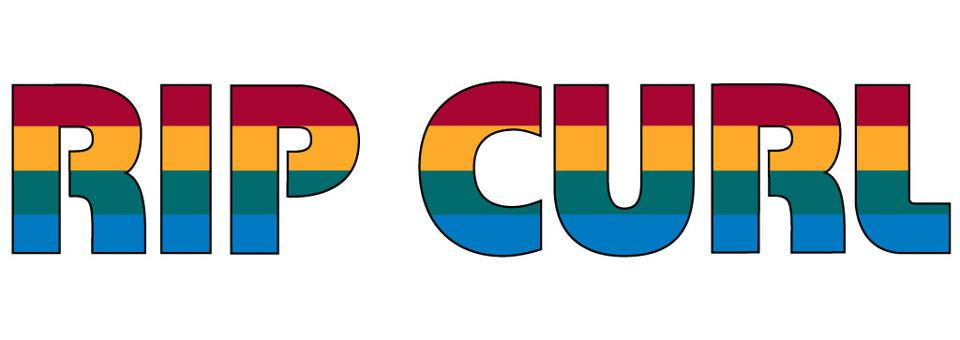
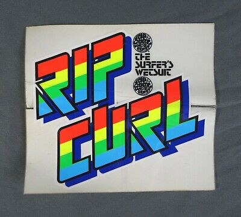
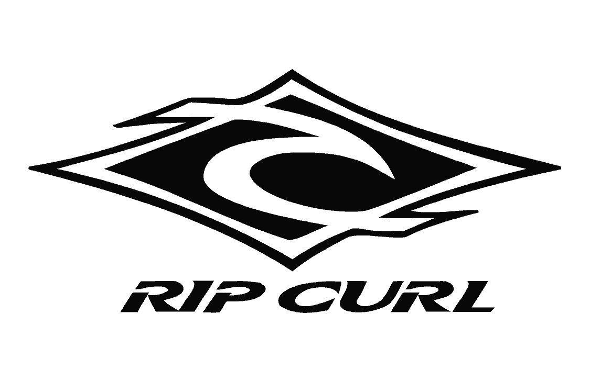
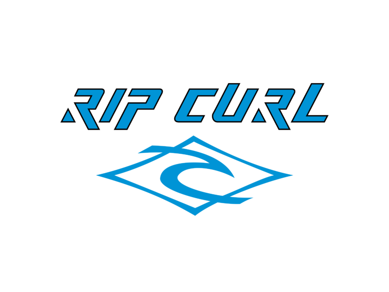
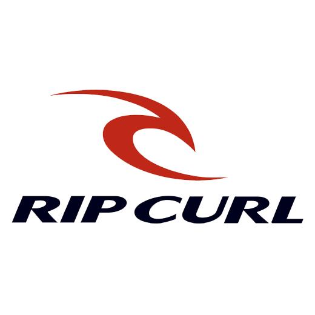

Rip Curl is one of the biggest and most important Surf Brands in the world, it was founded in 1969 and has since grown and evolved to meet the needs of the customers and their philosophy. 

Rip curl are the number one market leaders for surfing wetsuits and have been for more than 30 years, they are setting standards for the wetsuits of the future and are constantly developing their own technology. The market for rip curl therefore tends to be for outdoorsy people since they also sell mountain-wear as well as their clothing range for men, women and children, they are worth over $350 million in 2020. 

In the past 60 years Rip Curl have changed and evolved in more ways than we can know but the most obvious change comes in the physical form of the branding, this being- logo, typography, colour and size of font. These are all things that are vital in marketing to attract and keep the right clients.

When they first launched the company the logo was black and white chunky writing squished up into a circle which is one of the most iconic and well known designs, we still see this logo on air fresheners, t-shirts, sweatshirts and on their wetsuits in most surf shops. 

Back then, as they continued to grow they began to incorporate more rainbow colours to fit the era and the vibe of their customers. This stuck with through the late 1970's right into the 1980's. They still incorporate these rainbow colours into the brand today even though they have changed dramatically since to keep up with current trends and fashion trends.

The third wave of branding came in the form of 3D typography, and even though the font and style changed they still decided to stick with the rainbow colours, this brand new 3D model stuck with them for the rest of the 1990's. 

At the end of this era Rip Curl began to take off worldwide and they were making huge amounts of money which resulted in a re-brand with a brand new logo, new typography and a new colour scheme. This is when the rip curl wave was born, which we still see today.

After the re brand Rip Curl switched things up every few years, different colours and effects were tried and experimented with, the first one being - water Camouflage.

The next update removed the Camouflage design and brought in the most memorable design which was marketed and aimed more towards surfboards, wetsuits, posters and other merchandise. One adaptation changed the colours from black to red in 2014. They later on did something they had never done before- they wrote all of the typography in lower case characters which was then replaced by the blade logo in 2015.

The evolution of the Rip Curl brand and logo is impressive and shows clear progression over the span of 50 years. Each logo changes in colour, size and shape to reflect the times each were living through and to reflect the ethos of the customers.