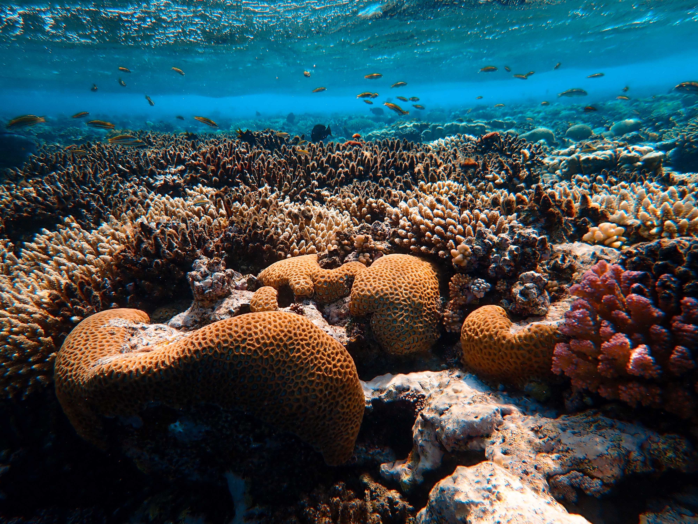
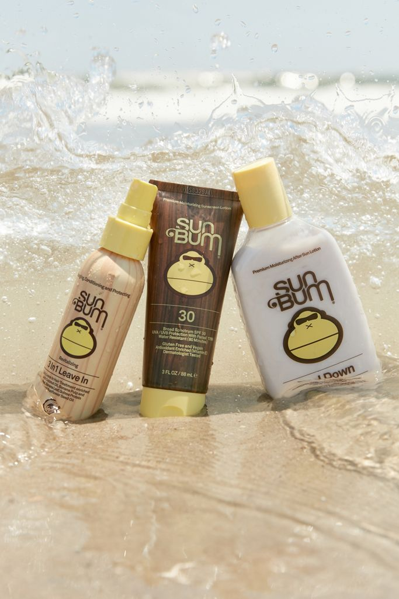
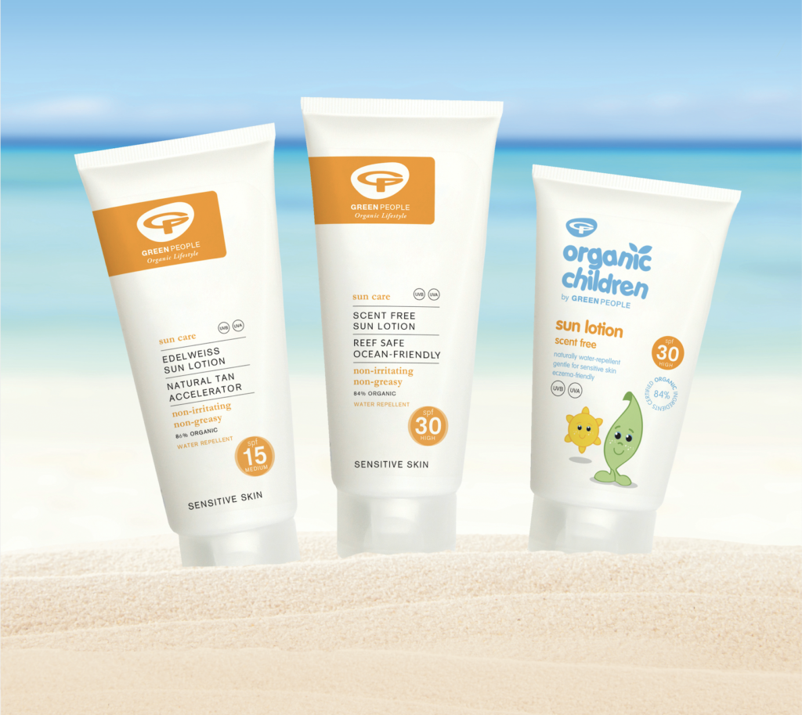
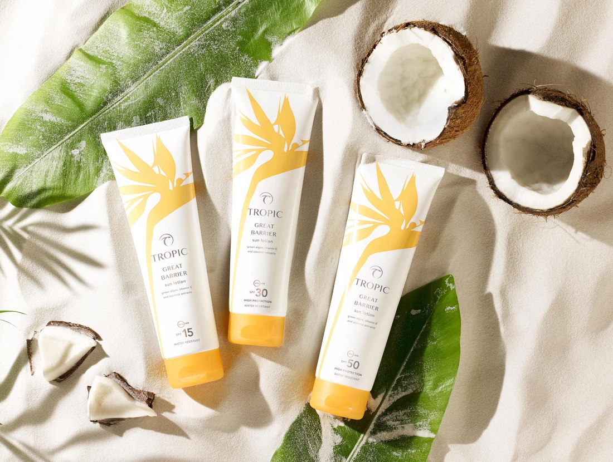

One of the best things we can do for our planet and our ocean is to leave behind as little damage as possible, suncreams can have a huge impact on our ocean, with a human population of 7.8 billion, every time each of us swim in the ocean, we bring those chemicals in with us. These chemicals contain nanoparticles which disrupt the coral's reproduction and growth cycles, which in turn- bleaches and kills our coral reefs. 

Since this has come to light, reef safe suncreams have become higher in demand, these brands are being pushed by surf companies, millennials and environmentalists who are helping us become more and more conscious of our footprint on the planet and what we can do to minimise the damage we inflict on our planet.

There is a wide variety of choice in 2020, and although each brand have a slightly varied ethos and they come in different colours, fonts and sizes they all share similarities.

The first, and one of the most popular brands in the United States (and now in the UK) is the brand -Sun Bum, who- In November 2011, were nominated for an Accessory Product of the Year award at the Surf Industry Manufacturers Association (SIMA) Image Awards. 

Sun Bum have different lines of suncream, each coming in different colours (a range of light browns, dark browns, yellow and white). The typography always stays the same- a font called 'AKI LINES' which was originally Designed by Akihiko Seki in 1970. It is bold and with curly longer letters at the end of the 'bum'. 

They used the shape and design of the font but made it thinner and solid rather than with thin line (3D). In each of the ranges the colour of the font changes- for example, in the 'cool down' line they use the brown colour to contrast the light blue formula, in the original dark packaging they use the yellow font and in the mineral line with white packaging they use the light brown font. 

The colour scheme in general is- white, yellow and brown, including the colour of the logo which is a yellow monkey with sunglasses on. 

Their ethos is: 

> We care about the planet.
>
> We care about the animals.
>
> We care about our families.
>
> So, of course we don’t use any ingredients that could hurt any of them.

Another popular brand is -Green People. 

Their packaging is very minimal- white with black typography and an orange logo- very similar to Sun Bum but with more of a minimal appearance, the orange logo seems like it is meant to represent the sunshine, which is very similar to sun bum. 

They use the fonts 'Helvetica Now Text' for the 'Green People' text- with the 'green' in extra bold and the 'people' in medium. The font 'Garamond Pro Bold- in Italic' is used for the 'Organic Lifestyle' in the logo. All of this is in Black. The Logo consists of the letters 'GP' in an orange square.

Green People is less of a 'surf brand' and more of a brand specifically made and branded as clean, natural skin care, made by people who want to put your skin and the environment first. They use fully biodegradable sugar cane packaging which is reflected in the price point. They are not linked to surfers in particular but are recommended by them as advocates for the ocean and the reef. 

Another popular UK suns cream brand is **topic skin care**. They brand themselves as

>  BEAUTY WITH A CONSCIENCE

A brand that puts animals and the environment first- Supported by The Vegan Society and PETA as a 100% cruelty-free brand, now and always.

They use the font- 'Accent Graphic by G'-Type in 'medium' in all black. Their logo is the word 'TROPIC' in a soft black colour, wrapped into a half oval shape with a leaf hanging off of the top left corner. 

More similar to Green People than Sun Bum but with the same ethos of leaving minimal damage to our coral.

Something I have noticed when looking at these brands is that the colouring of the logos are all identical, with mainly white packaging, black fonts, and orange logos.

These suncreams all have much in common and in more than one way, not only do they all have similar typography and colour schemes , but their passion for the environment and the animals is what shines through and is what sells in this niche market.