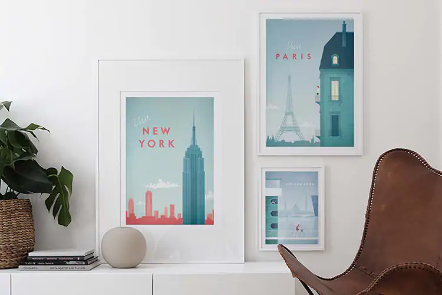

Henry is a freelance, full-time illustrator, living in France. His vintage-like, minimal travel posters are an effect of a time consuming and a very consequent work on his style. 

Henry uses two different fonts consistently for the name of each place and the word 'visit' in each print.

The fonts he uses are- Braisetto Thin by Adam Ladd in italic for the 'visit' and Curwen Sans in Bold by K-Type for the name of the place that he is illustrating.

