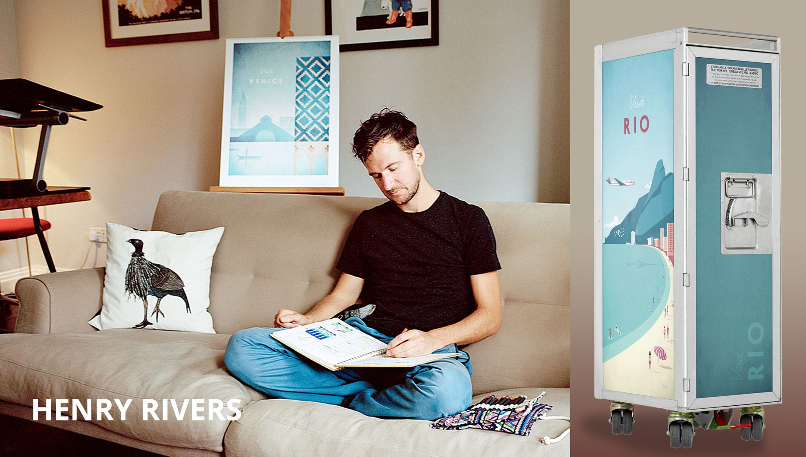

Henry Rivers is an english artist and freelance illustrator well known for his minimalistic travel posters that are sold worldwide.

His posters consistently have the same colour scheme, style and illustration. Each poster looks and feels the same, because of this- his art has become more and more recognisable which has resulted in him becoming more and more popular around the world. 

Typography is so much more than a way to make something look beautiful, it's a vital component of user interface design, successful typography will set the overall tone for a company, a product or anything that involves typeface- which almost everything does. 

The typography that Henry Rivers uses two different fonts consistently for the 'name' of each place and the word 'visit', which is on every one of his travel prints.

The fonts he uses are- **'Braisetto Thin in italic'** by Adam Laddin and **'Curwen Sans in Bold'.** 

The 'braisetto' font is used for the 'visit' and the curwen sans is used for the name of the place that he is illustrating.

Because Henry uses the two same fonts in every single travel poster and the same style of illustration he has managed to create an extremely distinct, this has helped his success because the consistency has made his work recognisable, he is now an artist that is sought out and remembered specifically for these niche travel posters.

These fonts hold the ideal middle ground of both femininity and masculinity. He has created a unisex market, meaning that he has opened up the market to all genders. The font **'Braisetto Thin in italic'** is the more feminine of the two. The **'Urwen Sans in Bold'** is more masculine as it is thick and bold. This has logically doubled his market demographic as the posters are unisex, neither particularly manly nor feminine. 

The '**Braisetto Thin'** is a smaller, more petite font, with 'swashes', whereas '**Urwen Sans'** is thicker with straight edges. If he had only used the Braisetto font his market would've been geared more towards females which would not have sold as well, the contrast of the two fonts also plays a huge roll in the appearance of the posters and how professional and visually pleasing they are.

His choice of font might seem insignificant, but it plays a huge role in how successful his artwork has become. 

His choice of consistent font, style of illustration and colour scheme has made him become recognisable and therefore more of a success.  

Each poster comes with the same aesthetic but with different illustrations for each country and place that he is trying to capture.

I would describe his work as both peaceful and nostalgic, the kind of artwork that can fit easily into any home.