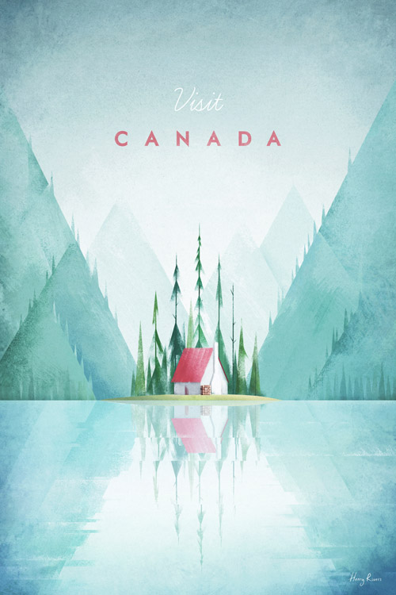

Henry is a full-time, freelance illustrator well known for his minimalistic travel posters sold globally.

His posters consistently have the same colour scheme, style and illustration. Each poster looks and feels the same, because of this- his art has become more and more recognisable which has resulted in him becoming more and more popular around the world. 

Typography is so much more than a way to make something look beautiful, it's a vital component of user interface design, successful typography will set the overall tone for a company, a product or anything that involves typeface- which almost everything does. 

The typography that Henry Rivers uses two different fonts consistently for the name of each place and the word 'visit' in each print.

The fonts he uses are- Braisetto Thin by Adam Ladd in italic for the 'visit' and Curwen Sans in Bold by K-Type for the name of the place that he is illustrating.

His fonts stay the same in each piece, with every travel piece he has created staying the same, this creates a consistency that helps him become more recognisable and therefore more popular.

The fonts stay the same in every piece or work. 

He also found the perfect middle ground between feminine and masculine which creates an equal balance, this logically has made his demographic double- The 'Braisetto Thin by Adam Ladd in italic' for the visit holds a feminine touch as it's smaller than the next and is also thin and curly. Whereas on the other hand the font urwen Sans in Bold is more masculine and solid.

If he were to have just used the Braisetto font his market would've been geared more towards females and would therefore not be so popular.

His use of font is something that gives him an edge in the market, because of this, his work is easily recognisable and has since become popular, which has made him millions. He started getting noticed more and more off of Pinterest and with each poster comes a different aesthetic based on the country- i would describe them as both peaceful and nostalgic, the kind of artwork that can fit easily into any home.