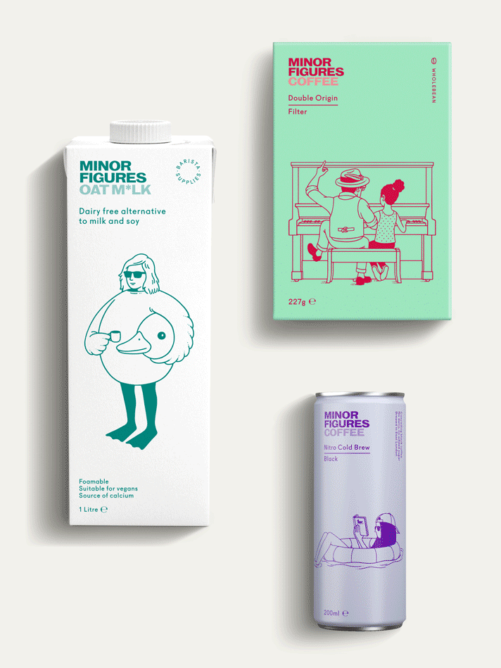
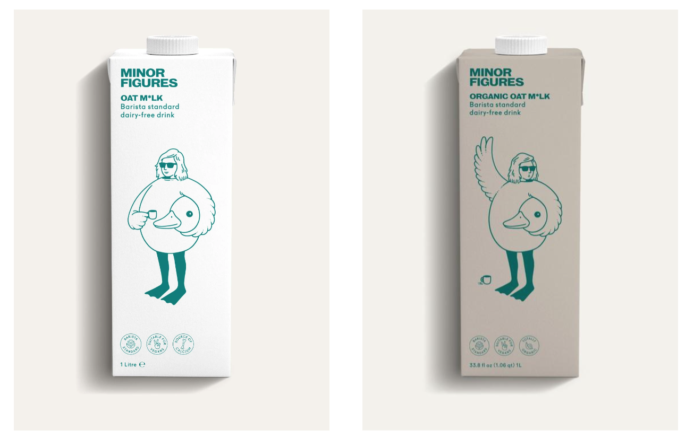
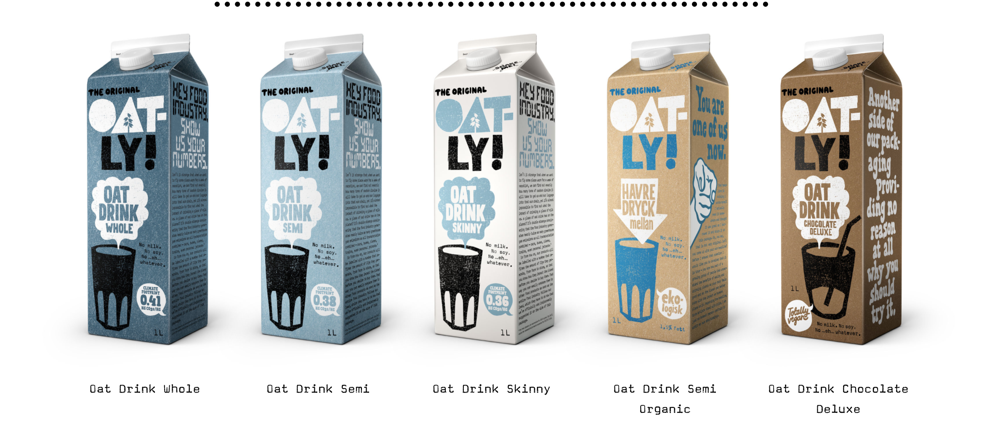

The Oat Milk industry is growing every year, and the most popular brands include- Oatly, Rude Heath, Minor Figures and Innocent. 

Each of these brands have a different ethos, colour scheme and typography set up but all have one thing in common: they're trendy.

> "We make plant-based, 100% vegan products to lift your coffee and your mind – be that in the comfort of your home or in your favourite local spot."- Minor Figures 

Minor Figures have two oat milk options- organic and original. Both of these are in plain colours, the original white with aqua writing and the organic in charcoal with aqua writing also. All of the illustrations are also all in the same aqua blue colour.

Oatly is similar, with 5 different options with a colour range of blue, baby blue, grey, white, light brown and dark brown. All typography is in a mixture of black, white and blue depending on the range.

