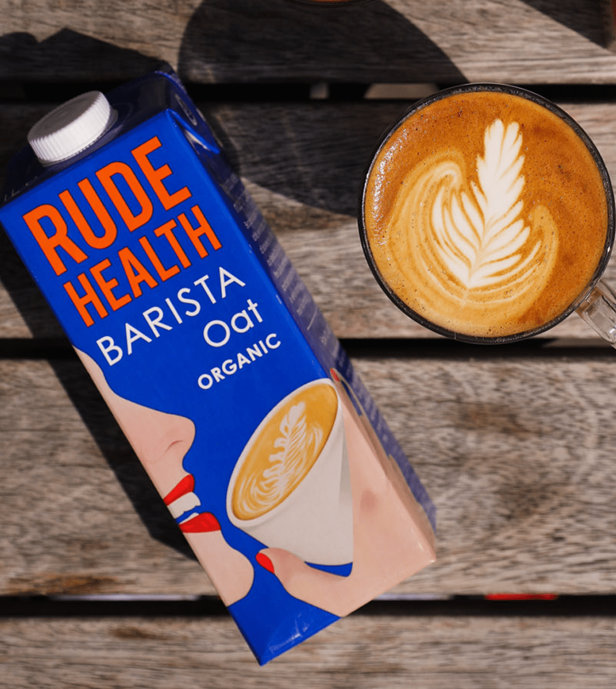

The Oat Milk industry is growing every year, and the most popular brands include- Oatly, Rude Heath, Minor Figures and Innocent. 

Each of these brands have a different ethos, colour scheme and typography set up but all have one thing in common: they're trendy.

> "We make plant-based, 100% vegan products to lift your coffee and your mind – be that in the comfort of your home or in your favourite local spot."- Minor Figures 

Minor Figures have two oat milk options- organic and original. Both of these are in plain colours, the original white with aqua writing and the organic in charcoal with aqua writing also. All of the illustrations are also all in the same aqua blue colour.

The typography stays consistent throughout the entire brand, including in their cold brew cans, filter coffee and apparel. 

The typography Minor Figures uses is original but very similar to- 'RW Linear ExtraWide Ultra Bold by URW Type Foundry.

The M and N are slightly thinner, and the G has a slight swash at the bottom of it. The i in 'milk' has a '*' as a replacement as it is a vegan brand. 

Oatly is similar, with 5 different options with a colour range of blue, baby blue, grey, white, light brown and dark brown. All typography is in a mixture of black, white and blue depending on the range.

> "Our sole purpose as a company is to make it easy for people to turn what they eat and drink into personal moments of healthy joy without recklessly taxing the planet’s resources in the process"

The typography used stays consistent throughout the entire brand, including in their yogurts, cold brews, ice creams and spreads.

The typography OATLY uses is original but very similar to 'kokoschka print' by pintassilgo Prints. 

The typography is bold with sharp edges, the A in 'oat' is a block triangle with a tree cut out of the middle and the colour of the first half is blue and half second half black.

> "WE’RE RUDE HEALTH- Brilliant ingredients. Nothing artificial. Nothing refined."

Rude Health have simple graphics and typography but with a brighter colour range- they have purple, pink, blue, green, brown and white- each type of milk comes in a different colour. 

The Oat is bright blue, dark yellow and dark brown. 

