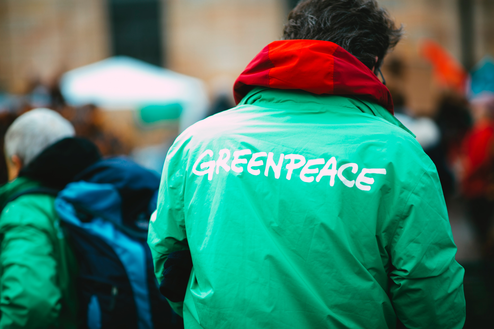
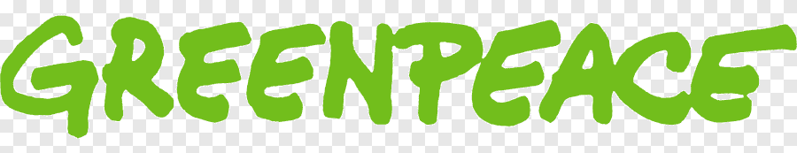
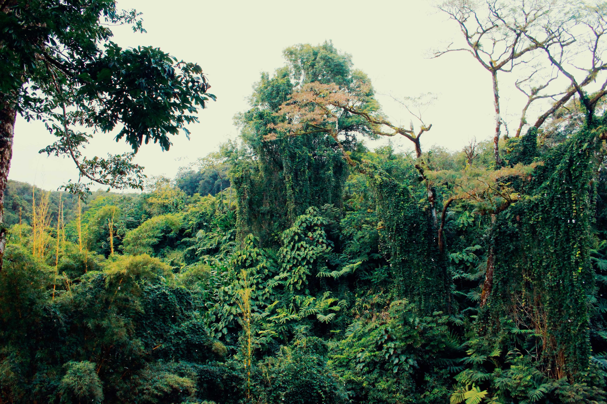
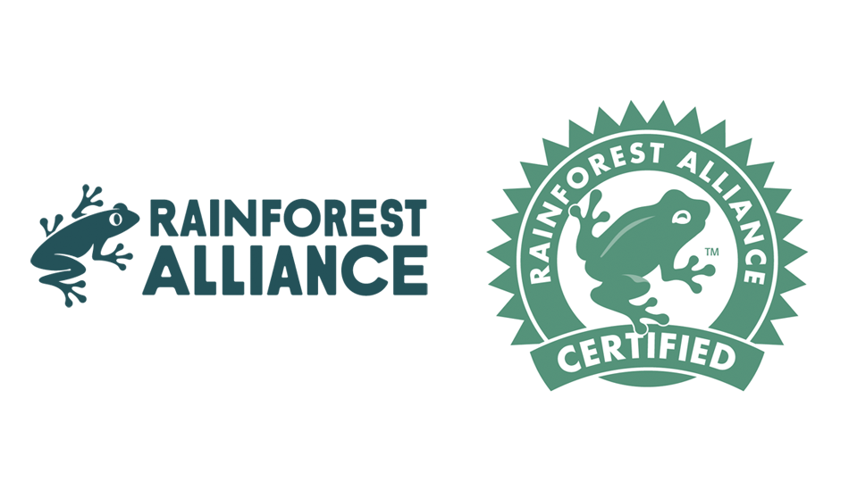
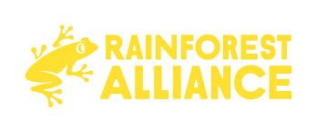

In 2020 the climate crisis is at the forefront of our minds, we were given a clear reminder just a few months ago that 'The Earth has a deadline' and we have less than 7 years before what we have done to our planet becomes irreversible. 

Three of the largest and most popular ethical environmental charities that have a high impact are- **Green Peace**, **Rainforest Alliance** and **Friends Of The Earth.**

Each of these charities have different aims and branding but all have one thing in common: they want to save our planet while we still can.

**Green Peace** is 'a movement of people who are passionate about defending the natural world from destruction'. They are privately funded and are not government owned, leaving them free to confront both the government and corporations who are responsible for the destruction of the natural world. 

As a brand they are extremely honest about who and what they are. 

A lot of people support them not only because of their independence but also because they are not afraid to call out governments to stop 'dragging their feet' and bring in radical changes. 

As a brand they present themselves with logos, typography and colour schemes. 

Their logo is the word '**Greenpeace**' in an original font very similar to '**Wimp Out**'. It is in all capitals in casual bright green lettering.

As a core font for their websites they use '**Helvetica Neue**'.

Another ethical non profit charity is '**Rainforest Alliance'.** 

They are working on "**building an alliance to protect forests, improve the livelihoods of farmers and forest communities, promote their human rights, and help them mitigate and adapt to the climate crisis**".

They present themselves to be mainly focussed on all forests and wildlife which we can see reflected in their logos- 

The original logo are the words '**Rainforest Alliance**' in the font '**Futura Bold**', in all capitals in a both dark blue and a darker green to reflect that it is eco-friendly. The logo also includes a little tree frog that sits up on the left hand side of the words in the same colour as the writing. 

As a core font for their websites they use '**Touche**' by Indian Type Foundry.

They have since changed the colour of the logo and it is now in a beautiful sunny yellow colour. 

**Friends Of The Earth are '**part of an international community dedicated to protecting the natural world and the wellbeing of everyone in it.'

They 'lead campaigns, provide resources and information, and drive real solutions to the environmental problems facing us all.'

Friends of the earth have a very simple Logo. It is 'Friends of the Earth' in the font '**Arial Black**' a sans serif designed for 'monotype' typography by Robin Nicholas. Next to those words is a hand drawn messy circle with one side thicker than the other. 

As a core font for their websites they use 'Texicali Regular' by FontMesa.

The website is currently using an all white version in front of a navy background, however they occasionally change up the colour scheme and use the black font with the green circle. 

All of these charities have many things in common. 

All of them use the same colour schemes of green logos and green typography, they all use a bold typeface with 'Greenpeace' a little bit thicker than the others. 

The green in each of these brands are supposed to be representative of the environment and to "**reflect its eco-friendly philosophy and spirit of peace, health and balance**."