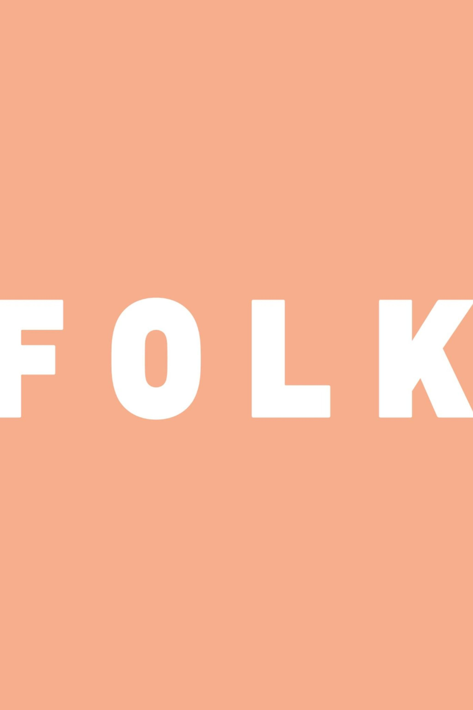
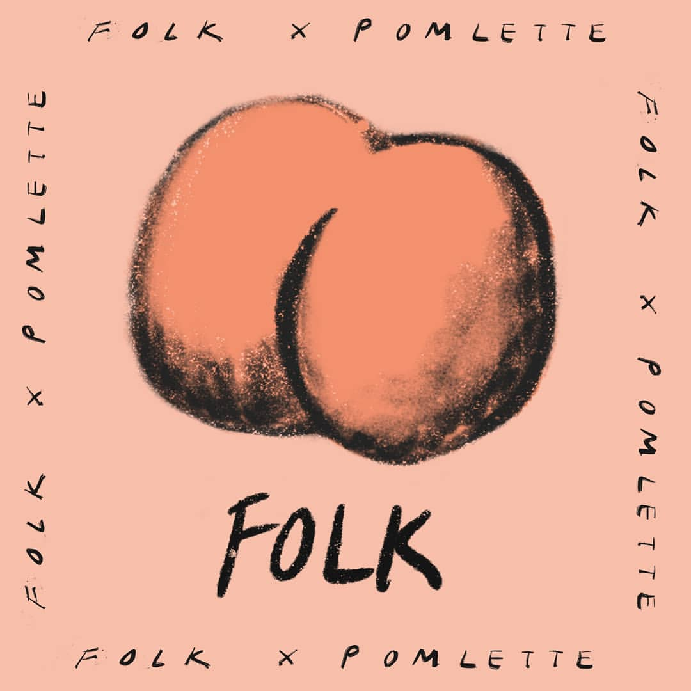
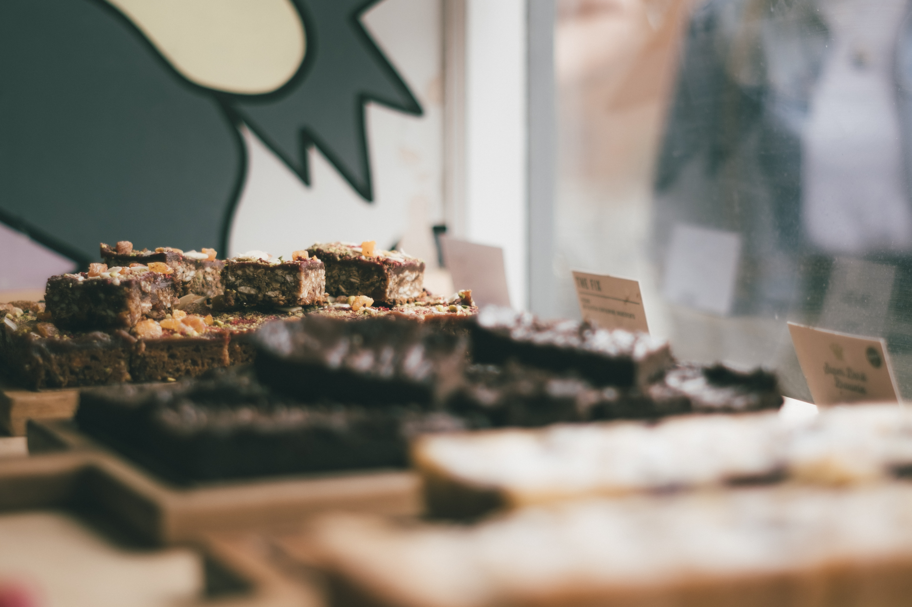

How do independent cafes in the UK brand themselves and how do they choose their typography?

The Folk Cafe is a small independent cafe located in Bury Saint Edmunds Suffolk. It has a chill atmosphere, covered in plants and fairy lights, they sell a variety of handmade products, coffees and are dog friendly.

The font they use in their logo is '**DIN Next Paneuropean W1G Black'** by Linotype. It is a **bold**, thick typeface in white with a peach backdrop. 

They also have used other fonts and logos as 'special additions/ collaborations' to brand themselves-

In their collaboration with 'Pomlette' an illustrator they made a new logo with new typography. 

They used the font '**Ugiftig**' by Bogstav with some paint brush strokes over the black to make it look hand-drawn, making it possible to see the peach background underneath parts of the letters. They used the same font but thinner around the edge if the logo and the peach illustration which is on top of the letters 'FOLK'. 

Another small independent cafe is 'Jericho Coffee Traders'- Located in central Oxford. They are a 'warm, laid-back espresso bar serving coffee drinks alongside an array of baked goods & sweets.'

The font they use in their logo is '**DIN Next Paneuropean W1G Black'** by Linotype. It is a **bold**, thick typeface in white with a peach backdrop.