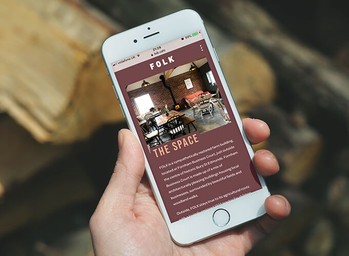

How do independent cafes in the UK brand themselves and how do they choose their typography?

The Folk Cafe is a small independent cafe located in Bury Saint Edmunds Suffolk. It has a chill atmosphere, covered in plants and fairy lights, they sell a variety of handmade products, coffees and are dog friendly.

They are a boho cafe