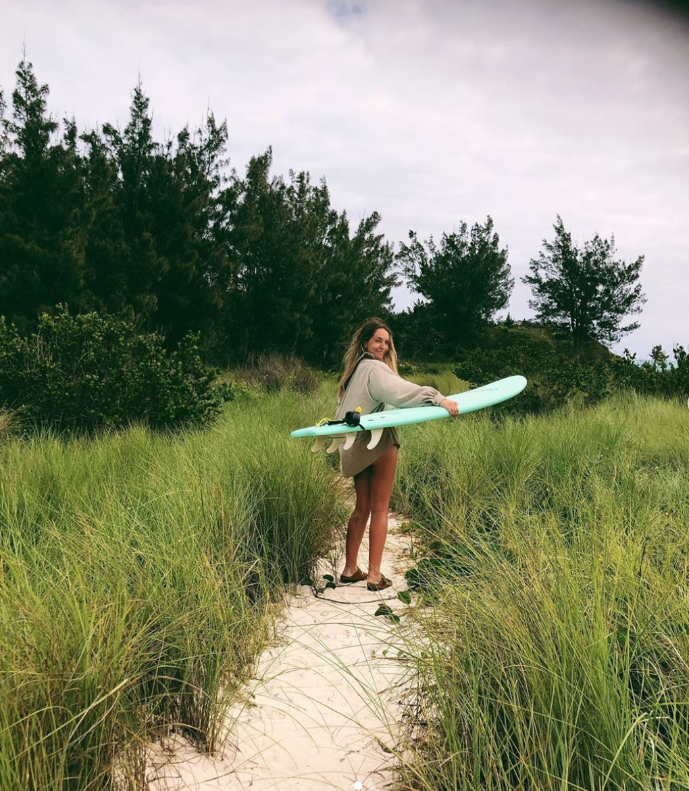
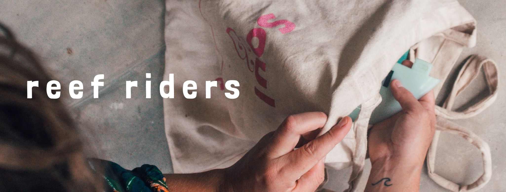

**ABOUT ME:**

My name is Poppy, I was born in Suffolk- England but have since relocated to Bermuda- a tiny island in the North Atlantic Ocean. I now live in-between Bermuda and Oxfordshire where I study media, journalism and book publishing at Oxford Brookes University;

After I graduate I ideally want to work in the book publishing industry. My dream job would be to work within the Children's publishing industry working for Bloomsbury.

**ABOUT MY BLOG:**

My blog is a space to talk and explore typographic design in all aspects of life but focussing mainly on products and ideals that have a positve impact on our enviroment and our reefs.

We are living in uncertain times, our reefs are dying and collectively we need to do everything we can to keep them protected for as long as possible. This blog is going to be used to talk and analyse all ocean related brands that support our planet or brands that share that ethos-

Within this website, the typographical and design choices I have made are all deliberate.

**MY LOGO:**

**MY BANNER:**

