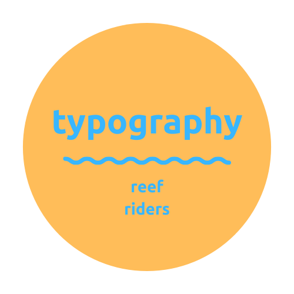

**ABOUT ME:**

I'm Poppy, I aspire to work in the children's publishing industry. I have a fascination for the environment and our oceans. As someone who lives on a small island in the North Atlantic Ocean I am surrounded by reefs that keep my family and I safe from all weather conditions, without these reefs my home in Bermuda would not survive.

**ABOUT MY BLOG:**

We are living in uncertain times, our reefs are dying and we need to do everything we can to keep them on our planet for as long as possible. This blog is going to be used to talk and analyse all ocean related brands that are there to support our planet or brands that just explore and show off our planet- typography is a huge part of branding and creating brand consistency and memorability.

Within this website, the typographical and design choices I have made are all deliberate.

**MY LOGO:**

**MY BANNER:**

